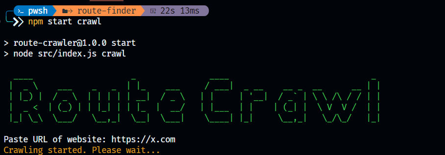

# vidownload js



vidownload js is a Node.js based CLI application designed to make it easier for users to download videos from Instagram Reels. This application uses technologies such as Puppeteer to control the browser and Axios to make HTTP requests to the Instagram server.

## Main feature

- **Simple Use**: Just enter the URL of an Instagram Reels video, and the app will download it automatically.
- **CLI Interface**: Built using readline for an interactive command line interface.
- **Puppeteer for Automation**: Use Puppeteer to access and control Instagram web pages.
- **Axios for HTTP Requests**: Leverages Axios to download videos from a given URL.

## Installation

1. Clone the repository:

   ```bash
   git clone https://github.com/RizkyZaki/route-crawler.git
   cd route-crawler
   ```

2. Install the required dependencies:

   ```bash
   npm i
   ```

## Usage

Run the main script:

```bash
npm start crawl
```
